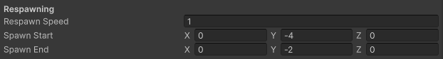
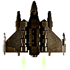

<h1 align="center">Captain Loop</h1>
<p align="center"><strong>Captain Blaster With Respawn Loop</strong>
<br>
Needs: 1 script, 43 lines</p>
<div align="center"></div>

## Feature Goal
This feature's requirements were a bit more involved. To successfully implement the feature, the following gameplay criteria was required:
- A new "mothership" object at the bottom of the screen destroys everything that touches it
- Meteors can hit the Player object and push it downwards
- If the Player object is "destroyed" by the mothership, it respawns using the following sequence:
  - The player loses control of the game
  - The Player object dissapears
  - The Player object starts to move slowly from the bottom of the screen to its initial position
  - The player regains control of the game

## Notable Challenges
The main challenge in implementing this feature was that any logic in the PlayerController script stops running when the Player GameObject it is attached to is destroyed. This means that if the mothership uses Destroy() on the Player object, any respawning logic in scripts on that object won't work. This specific problem also lent itself to great confusion over when a collision check should use OnTriggerEnter2D() or OnCollisionEnter2D(). 

The biggest unexpected challenge was with making sure that the Player object can be hit by the Meteors taking physics into account, but won't keep any velocity or rotation applied this way after the Player respawns. 

Ultimately, my solution abandons the idea of calling Destroy() on the Player entirely, and instead mimics this behavior by simply teleporting the Player behind the mothership, assigning it the default "Respawn" tag to track its respawning state, and then running the appropriate logic when the Player object has this tag. This is why velocity and rotation proved challenging, but they each can be reset in OnTriggerEnter2D() and Update() respectively.

## Key Takeaways
Pay attention to the following sections of code to make sure you understand how the solution works. This will help you apply relevant pieces to similar problems you encounter on your own.

The region "Respawning Variables" from line 11 to line 13 contains a vital piece of the puzzle. Make sure you keep these in mind while reviewing the code, and make sure to assign them in the Inspector if you want to test this project or implement similar logic in your own.

The "Mothership Collision" region contains all of the logic for determining when the Player should respawn and starting the process. If you want to implement something similar, you need to understand how the respawning process is started, and where in your script it should be triggered from.

Lastly, review the "Respawning Logic" region to see how the respawning itself is handled. This logic doesn't have to be triggered by assigning a tag on collision and checking for it in Update(), but this is the meat of the process however it is triggered.

## Inspector Steps
If you want to test this project yourself or implement a similar solution in your own project, pay attention to the following Inspector workflow steps:
1. This logic calls for a new tag. I called it "Mothership", but the name doesn't matter as long as it is consistent. Make sure any other required tags are also in your project.
2. Pay very close attention to which Collider2D components have .isTrigger set to True and which ones are False. This will inform which collision logic you use.
3. Neither of the variables added for this project are assigned in the script, so you will need to assign them in the Inspector and play around with their values.

## Review the Code
Just like in your local Unity projects, the code is located at [./Assets/Scripts/](https://github.com/jesterlumos/CaptainPingPong/tree/main/Assets/Scripts). The basic textbook logic has not been updated to reflect the new Input System implementation, the singleton pattern for GameManager, or any other newer change, but the relevant logic will work along with these upgrades, and the code is heavily commented to guide you to the important parts. All new code is located in the following script files:
- [PlayerController.cs](Assets/Scripts/PlayerController.cs)

## Build the Project
This repository is built from a valid Unity project. Unity Hub only needs these three directories (Assets, Packages, and Project Settings) to rebuild the project, so you can Add it to hub just like any other project. Follow the steps below:
1. Use the green "<> Code" button in the top right (pictured below) to download the project archive.
2. Use your OS's file system or a third party tool to extract the archive (let Jester or Professor Loop know if you need help with this).
3. Open and sign in to Unity Hub.
4. Navigate to the "Projects" section, and use the Add > Add Project from Disk option to add the project to Unity Hub.
5. Click on the project in your Projects list to open it in Unity Editor and test it.


## Contributing
If you are familiar with GitHub and with the open source, and you see something in this example project which could be improved, feel free to open a pull request. I make no guarantee that I will see or merge it, and students are NOT REQUIRED to contribute. This project exists as a resource for you, not a graded assignment. I will not be providing assistance with contributing to this project if you are not familiar with the process.

## Unrelated Lessons
None of these techniques are required for this feature implementation, but they offer more efficient, more standard, or more convenient ways to accomplish certain tasks. If you want to expand your horizons or implement some more advanced conventions into your Captain Blaster project, this can be a good place to start.

On **lines 3 and 4**, the following code can be found which utilizes the \[RequireComponent\] attribute:
```cs
[RequireComponent(typeof(Rigidbody2D))]
[RequireComponent(typeof(PolygonCollider2D))]
```
This attribute takes a type as a parameter (which we can feed in via typeof()) and tells Unity to always keep the given component on this GameObject. When you attach this script to a GameObject with no RigidBody2D or no PolygonCollider2D, Unity will automatically attach them for you. 

It also prevents you from accidentally removing the component, and gives a warning that you have used the \[RequireComponent\] attribute. Anytime we use GetComponent() via the scripting API, it is best practice to use \[RequireComponent\] so that the component is never null. If you no longer require the component in your script, make sure to also remove this attribute, or you will be forced to use unnecessary components. 

***

On **line 11**, the following code uses the \[Header\] attribute:
```cs
[Header("Respawning")]
```
This attribute just adds the provided string as a header in the Inspector to keep long lists of Inspector properties organized, as seen below:



***

**Line 18** in [GameManager](Assets/Scripts/GameManager.cs) shows a lambda expression:
```cs
private void Start() => SpawnMeteor();
```
In C#, Methods are a series of statements with the following parts:
1. An access modifier such as public or private
2. \[OPTIONAL\] Any additional modifiers like static or abstract (don't worry too much about these)
3. The type that the method returns (or "void" if it doesn't return anything)
4. A name for the method
5. Any parameters the method takes when it is called
6. The "body" of the method (the statements that are run when it is called)

Normally, that looks like:
```cs
public[1] int[3] Sum[4] (int num1, int num2)[5] 
{
    return num1 + num2;[6]
} 
```

Since the body consists of a single statement, and that statement isn't a more complex expression like an if statement, we can use lambda syntax to shorten the method declaration while keeping all the same parts:
```cs
public[1] int[3] Sum[4] (int num1, int num2)[5] => return num1 + num2;[6]
```

<small> Students, reach out to Jester if you have any further questions about this project. Happy coding!</small>